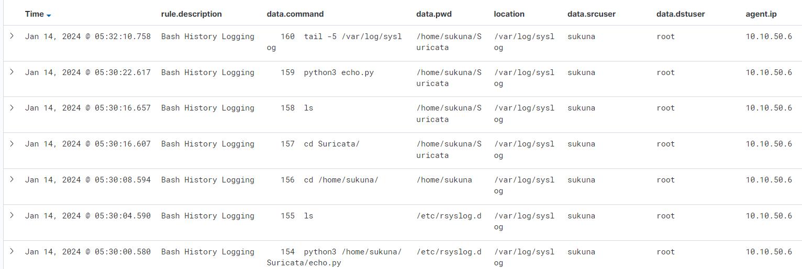

# Linux Command Logging with Rsyslog and Wazuh

## Linux configuration

### 1. Configure this command in bash.bashrc in order for every command to be logged in the following order

```bash
sudo echo -e '\nexport PROMPT_COMMAND="PREV_CMD=\$(history 1); RETRN_VAL=\$?; if [ \"\$PREV_CMD\" != \"\$LAST_CMD\" ]; then logger -p local6.debug -t Bash_History \"srcuser: \$(logname) : dstuser: \$(whoami) : \$(pwd) - \$(echo \"\$PREV_CMD\")\"; fi; LAST_CMD=\"\$PREV_CMD\""' >> /etc/bash.bashrc
```

### Use this command to apply this change in your terminal

```bash
source bash.bashrc
```

### 2. Create rsyslog configuration file and add the following line to specify the log destination

```bash
sudo sh -c 'echo "local6.* /var/log/commands.log" > /etc/rsyslog.d/bash.conf'
```
### 3. Restart Rsyslog

```bash
sudo systemctl restart rsyslog
```
### 4. Make a log rotation process to archive the archived logs (Edit it as you wish)

```bash
    sudo sh -c 'echo "/var/log/commands.log {
    daily
    rotate 7
    compress
    delaycompress
    missingok
    notifempty
}" > /etc/logrotate.d/rsyslog'
```
### 5. Configure Wazuh Agent ossec.conf

```bash
sudo nano /var/ossec/etc/ossec.conf
```
### Add the following XML block within the <ossec_config> section:

```xml
  <localfile>
     <location>/var/log/commands.log</location>
     <log_format>syslog</log_format>
  </localfile>
```

### Restart the wazuh-agent:

```bash
sudo systemctl restart wazuh-agent
```

### 6. Configure the decoder at the Wazuh Manager

```bash
sudo nano /var/ossec/etc/decoders/local_decoder.xml
```
### Add the following XML block into an empty section:

```xml
<decoder name="Bash_History">
  <program_name>^Bash_History</program_name>
</decoder>

<decoder name="Bash_History">
  <parent>Bash_History</parent>
  <regex>srcuser:\s*(\S+)\s*:</regex>
  <order>srcuser</order>
</decoder>

<decoder name="Bash_History">
  <parent>Bash_History</parent>
  <regex>dstuser:\s*(\S+)\s*:</regex>
  <order>dstuser</order>
</decoder>

<decoder name="Bash_History">
  <parent>Bash_History</parent>
  <regex>:\s+(/\.+)\s+-</regex>
  <order>pwd</order>
</decoder>

 <decoder name="Bash_History">
  <parent>Bash_History</parent>
  <regex>-\s*(\.+)$</regex>
  <order>command</order>
</decoder>
```
### 7. Configure the rule for the Wazuh Manager:

```bash
sudo nano /var/ossec/etc/rules/local_rules.xml
```

### Add the following XML block into an empty section:

```xml
<group name="bash">
  <rule id="100010" level="3">
    <program_name>^Bash_History</program_name>
    <description>Bash History Logging</description>
  </rule>
</group>
```

### 8. Test the rule with wazuh-logset

### Copy a raw log from the Wazuh Agent to test it:

```bash
sudo tail /var/log/syslog
```
### The output of the logs should return like this:

```
Jan 14 03:31:02 suricata Bash_History: srcuser: sukuna : dstuser: root : /etc/rsyslog.d -   155  ls
Jan 14 03:31:06 suricata Bash_History: srcuser: sukuna : dstuser: root : /home/sukuna -   156  cd /home/sukuna/
Jan 14 03:31:14 suricata Bash_History: srcuser: sukuna : dstuser: root : /home/sukuna/Suricata -   157  cd Suricata/
Jan 14 03:31:15 suricata Bash_History: srcuser: sukuna : dstuser: root : /home/sukuna/Suricata -   158  ls
Jan 14 03:31:21 suricata Bash_History: srcuser: sukuna : dstuser: root : /home/sukuna/Suricata -   159  python3 echo.py
```

### Run `wazuh-logtest` to simulate a log entry and check if the decoder and rule are working as expected:

```bash
sudo bash /var/ossec/bin/wazuh-logtest
```
### Paste the log you have entered to intiate the log test:

```
Jan 14 03:31:21 suricata Bash_History: srcuser: sukuna : dstuser: root : /home/sukuna/Suricata -   159  python3 echo.py
```

### The result should come out like this:

```
Jan 14 03:21:56 suricata Bash_History: srcuser: sukuna : dstuser: root : /etc/rsyslog.d -   150  test

**Phase 1: Completed pre-decoding.
        full event: 'Jan 14 03:21:56 suricata Bash_History: srcuser: sukuna : dstuser: root : /etc/rsyslog.d -   150  test'
        timestamp: 'Jan 14 03:21:56'
        hostname: 'suricata'
        program_name: 'Bash_History'

**Phase 2: Completed decoding.
        name: 'Bash_History'
        command: '   150  test'
        dstuser: 'root'
        pwd: '/etc/rsyslog.d'
        srcuser: 'sukuna'

**Phase 3: Completed filtering (rules).
        id: '100010'
        level: '3'
        description: 'Bash History Logging'
        groups: '['bash']'
        firedtimes: '1'
        mail: 'False'
**Alert to be generated.
```
### 9. Restart the wazuh-manager

```bash
sudo systemctl restart wazuh-manager
```

### Now check the Wazuh Dashboard discover logs and it should come out with every normal command:


## Feel free to adjust the instructions based on your specific requirements or preferences. Thank you.

